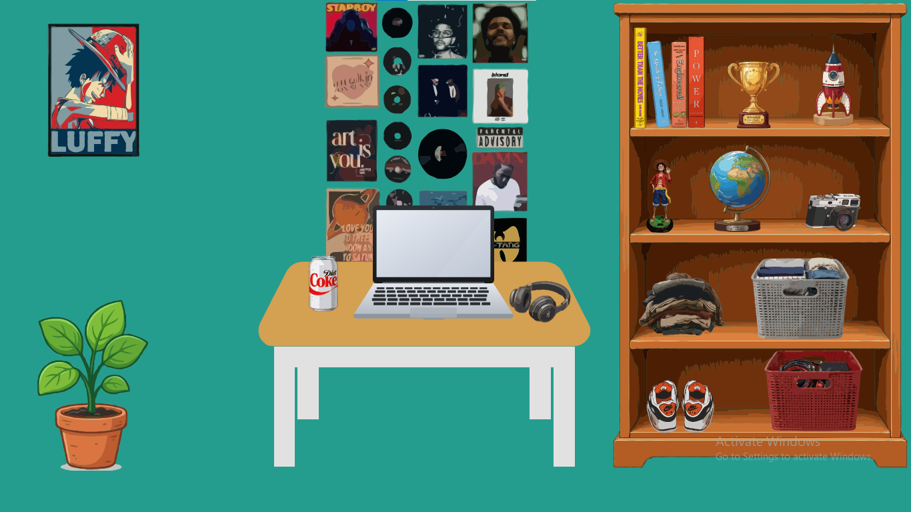
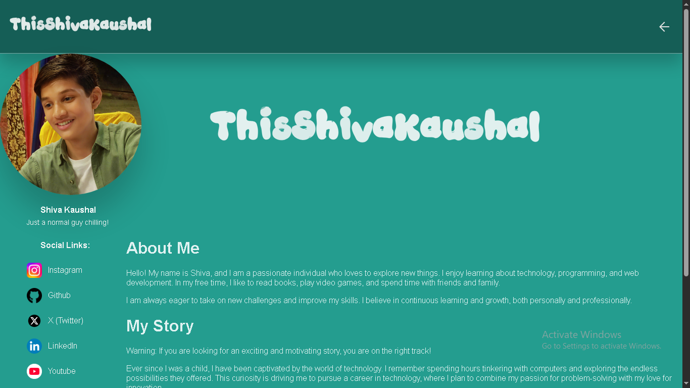

# My Room

This room is where my favorite belongings live and where I spend most of my time. But today, the doors are wide open—because I’m officially making my room public!

Check it out: ***https://shivaroom.vercel.app***


## Descrption
 
 I was completely bored by portfolio websites, because if you make it simple, then for people it is not worth it. For this reason, you have to make a flashy one with a ton of animation, which people with low-end mobiles are not able to open. Because of this reason, I chose to make a unique one. I just duplicated my room into a web-playable website. Now you can interact with my room—just hover on any object, like when our eyes focus on anything then everything gets blurred, the same principle I applied here. And yeah, this is the brief of my project. And also, when you click on the laptop, then you will transfer to my about me page, where you can know a lot of stuff.

### Screenshots

 
 

## Problem

It is not work in Mobile well, to make it work in mobile make your screen landscape. And it may work perfectly. But this works best in desktop screens. 

In ```Chrome``` Browser, it is tested, but not tested in ```FireFox``` and many more.

## Getting Started

  First, clone this Repo:

  ```git clone https://github.com/ThisShivaKaushal/MyRoom.git```

  Second, go the Project Folder

  ```cd MyRoom```

  Third, open

  ```Index.html```

## FrameWork

I use ```HTML``` and ```CSS``` for this project, because it is easy to write.

## Credits 

Full credit goes to HackClub and its Pixl YSWS, who motivate us to make such stuff. 

Hackclub: ***https://hackclub.com***
Pixl: ***https://pixl.hackclub.com***

## License
 
MIT. Take it, remix it, build your own room — just don't try to convince people the Diet Coke can was your idea.